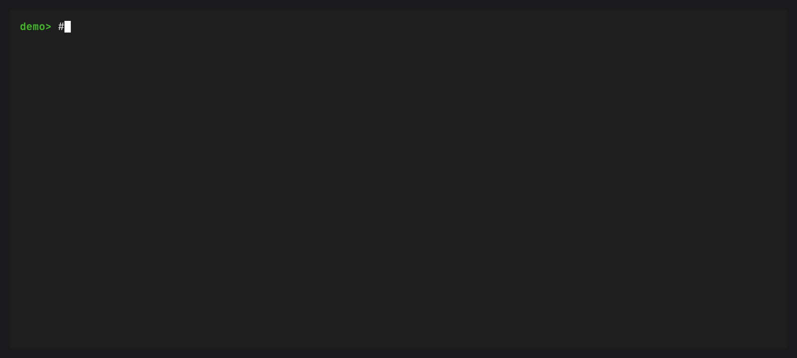

# conda-advise

Security advisories usually identify upstream projects and versions, while conda installs exact artifacts that can contain patches or vendored components.
That makes a direct name match weak evidence and makes an absent match easy to misread.

`conda-advise` checks public conda-forge package records, preserves the exact artifact identity, and tells you what evidence produced each advisory match.
Run `conda advise` to inspect an environment now.
The warning-only post-solve hook also calls attention to matching packages after a solve and before installation.

:::{warning}
This is alpha software with no published package release.
Use the [source installation](how-to/install.md) without changing a normal conda installation.
:::

Clone the repository and create its locked development environment:

::::{tab-set}

:::{tab-item} POSIX

```console
git clone https://github.com/jezdez/conda-advise.git
cd conda-advise
pixi install --locked -e dev
```

:::

:::{tab-item} PowerShell

```powershell
git clone https://github.com/jezdez/conda-advise.git
Set-Location conda-advise
pixi install --locked -e dev
```

:::

::::

Run the first scan from that checkout:

```console
pixi run --locked -e dev conda advise
```



With no target option, the command scans the active or default environment.
The default threshold flags high and critical matches, plus every match listed in the [CISA Known Exploited Vulnerabilities catalog](https://www.cisa.gov/known-exploited-vulnerabilities-catalog).

## From package record to evidence

```text
eligible public conda-forge package record
├── osv, default
│   └── artifact SHA-256 → Parselmouth → PyPI name and version → OSV
│       └── artifact_component evidence
└── basilisk, experimental
    └── conda-forge name and version → Prefix Basilisk
        └── upstream_version evidence
```

The default path sends an artifact SHA-256 to Prefix's Parselmouth service, then sends the normalized PyPI component name and exact version returned by Parselmouth to OSV.
`artifact_component` means that the component was associated with the exact archive and its version matched an OSV advisory.

For each eligible package, the opt-in Basilisk path sends Prefix one conda package URL containing the constant `conda` type, the constant `conda-forge` namespace, the canonical package name, and its version.
`upstream_version` means Basilisk matched that name and version, not the exact conda build.

An advisory match is a reason to investigate the exact package build.
It does not prove that vulnerable code is reachable or remains unpatched.
An unmapped package is `not_checked`, a failed attempted lookup is `incomplete`, and neither state means unaffected.
A completed provider query with no match is only a statement about that provider's inputs and data at that time.

## Before conda changes an environment

The post-solve hook checks only packages selected for linking.
It adds a severity tag to matching transaction records and prints a concise warning without adding a prompt or blocking the transaction.


## Choose a documentation path

::::{grid} 2
:gutter: 3

:::{grid-item-card} {octicon}`rocket` Tutorial
:link: tutorials/getting-started
:link-type: doc

Run a first scan and interpret its coverage and findings.
:::

:::{grid-item-card} {octicon}`tools` How-to guides
:link: how-to/install
:link-type: doc

Install from source, configure warnings, run offline, use CI, and trust a mirror.
:::

:::{grid-item-card} {octicon}`list-unordered` Reference
:link: reference/cli
:link-type: doc

Look up commands, settings, JSON fields, providers, and coverage reason codes.
:::

:::{grid-item-card} {octicon}`code` Python API
:link: reference/python-api
:link-type: doc

Use the public report, subject, coverage, finding, evidence, and failure models.
:::

:::{grid-item-card} {octicon}`book` Explanation
:link: explanation/matching-and-evidence
:link-type: doc

Understand matching evidence, privacy, caching, limits, and related tools.
:::

::::

## What leaves the machine

Only recognized public conda-forge records are eligible for network lookup.
Private channels, defaults, Anaconda commercial channels, local channels, and unrecognized mirrors are not queried.
When a matched advisory has a CVE identifier, the client downloads the CISA KEV catalog without sending a package, component, advisory, or CVE identifier to CISA.
Read the complete [privacy behavior](explanation/privacy.md) before enabling a provider in an automated environment.

```{toctree}
:hidden:
:caption: Tutorial

tutorials/getting-started
```

```{toctree}
:hidden:
:caption: How-to guides

how-to/install
how-to/configure-post-solve
how-to/choose-provider
how-to/use-offline
how-to/use-in-ci
how-to/allow-trusted-mirrors
```

```{toctree}
:hidden:
:caption: Reference

reference/cli
reference/configuration
reference/json-output
reference/providers
reference/coverage-and-reason-codes
reference/python-api
```

```{toctree}
:hidden:
:caption: Explanation

explanation/matching-and-evidence
explanation/privacy
explanation/cache-and-freshness
explanation/limitations
explanation/ecosystem-comparison
```

```{toctree}
:hidden:
:caption: Project

changelog
```
