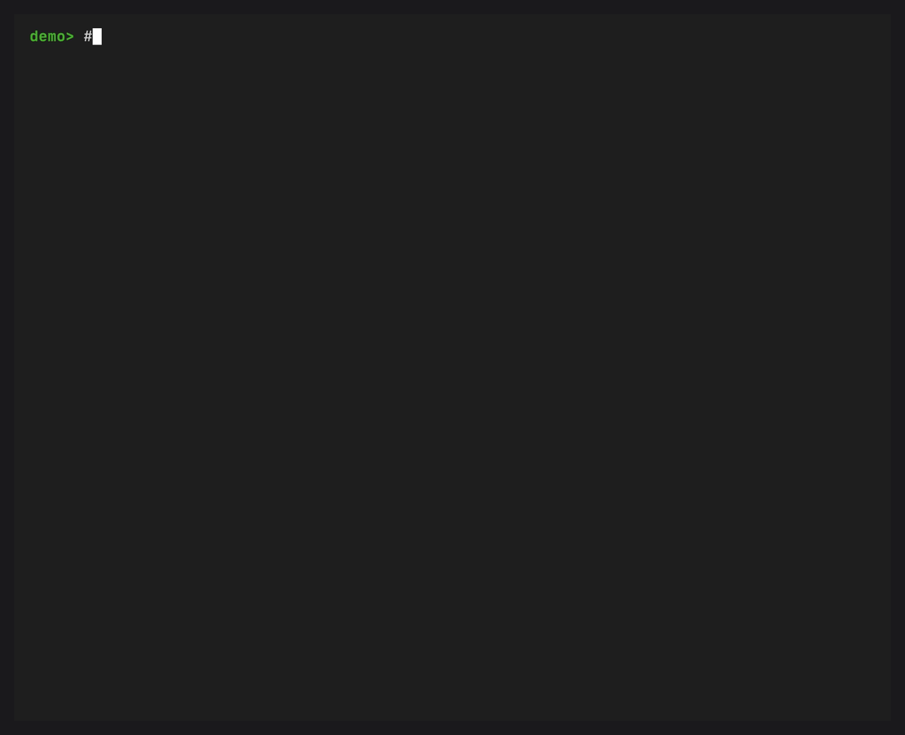

# Check an environment for advisories

This tutorial runs `conda-advise` from source, scans an environment, and explains its findings and coverage.

## Prerequisites

- Git
- [Pixi](https://pixi.prefix.dev/)
- Network access to [Parselmouth](https://github.com/prefix-dev/parselmouth) and [OSV](https://osv.dev/), plus [CISA](https://www.cisa.gov/known-exploited-vulnerabilities-catalog) for known-exploited CVE data

`conda-advise` has no published release yet.
These commands use the repository's locked Pixi environment.

## Start the development environment

::::{tab-set}

:::{tab-item} POSIX

```console
git clone https://github.com/jezdez/conda-advise.git
cd conda-advise
pixi install --locked -e dev
pixi run --locked -e dev conda advise --help
```

:::

:::{tab-item} PowerShell

```powershell
git clone https://github.com/jezdez/conda-advise.git
Set-Location conda-advise
pixi install --locked -e dev
pixi run --locked -e dev conda advise --help
```

:::

::::

The help output should identify the `osv` provider as the default and mark `basilisk` experimental.

## Run the first scan

```console
pixi run --locked -e dev conda advise
```

With no `--name` or `--prefix`, conda selects its active or default prefix.
The command reads installed conda package records.
By default, it queries providers only for records with artifact URLs beneath the canonical conda-forge channel or Prefix mirror.
See [privacy](../explanation/privacy.md) for the eligibility rules and request details.

The default lookup follows this path:

```text
artifact SHA-256 → Prefix Parselmouth → PyPI component name and version → OSV
```

Parselmouth uses the archive's SHA-256 to look up its Python components.
OSV matches each component name and version against its advisory data.

## Read the report

The demo uses fixed advisory data and produces this report.
Its temporary directory and local server port vary between runs.

```text
Conda advisory report
Target:    <temporary-directory>/prefix
Provider:  osv

Advisory matches

demo-package 1.0.0 py_0 (conda-forge/noarch)
└── CVE-2026-0001 [critical, CVSS 9.8, CISA KEV]
    ├── Summary: Demo package accepts an unsafe example input
    ├── Aliases: GHSA-demo-0001-0001
    ├── Upstream fixes: 1.0.1
    ├── Evidence: artifact component pkg:pypi/demo-package@1.0.0
    └── Sources: osv:GHSA-demo-0001-0001
        http://127.0.0.1:<port>/v1/vulns/GHSA-demo-0001-0001

Scan summary
Checked 1 of 1 artifacts.
Mapped 1, unmapped 0, not checked 0, incomplete 0.
Found 1 match, 1 at or above high or listed in CISA KEV.
```

The package heading identifies the conda build.
The advisory line shows its identifier, severity, highest CVSS score, and known-exploited status.
The evidence line names the PyPI component associated with the archive.
That association does not establish whether vulnerable code is reachable or patched in this build.
The upstream fix comes from the advisory and may not be available as a conda-forge package.

The summary counts coverage separately from matches.
An unmapped artifact is `not_checked` and a failed lookup is `incomplete`.
Neither state means unaffected.
A completed lookup with no finding only describes the provider's data at that time.

## Understand the post-solve warning

By default, the plugin also checks packages that conda plans to link after a solve.
Matching records receive a severity tag and a warning that points to `conda advise` for details.



The hook runs during dry runs and `-y` commands without adding a prompt.
Provider failures leave coverage incomplete and let conda continue.
Use the [post-solve configuration guide](../how-to/configure-post-solve.md) to change the threshold, deadline, or warning mode.

## Inspect the machine-readable report

Write one versioned JSON document to a file:

::::{tab-set}

:::{tab-item} POSIX

```console
pixi run --locked -e dev conda advise --json > advise-report.json
python -m json.tool advise-report.json | less
```

:::

:::{tab-item} PowerShell 7

```powershell
pixi run --locked -e dev conda advise --json | Set-Content -LiteralPath advise-report.json -Encoding utf8
Get-Content -LiteralPath advise-report.json | python -m json.tool
```

:::

::::

The document conforms to `conda-advise-report-v1`.
See the [JSON reference](../reference/json-output.md) for fields and exit behavior.

## Compare the experimental provider

Run a separate scan with [Basilisk](https://basilisk.prefix.dev/status):

```console
pixi run --locked -e dev conda advise --provider=basilisk
```

This sends eligible conda package names and versions to Prefix.
It uses the same allowed-origin list as the default provider.
Basilisk results use `upstream_version` evidence because they match names and versions without assessing the exact conda build.
See the [provider reference](../reference/providers.md) for details.

## Next steps

- Read [matching and evidence](../explanation/matching-and-evidence.md) before acting on a finding.
- Configure [post-solve warnings](../how-to/configure-post-solve.md).
- Use the [CI guide](../how-to/use-in-ci.md) with the documented exit codes.
- Review [privacy](../explanation/privacy.md) before enabling Basilisk persistently.
